# Итоговая контрольная работа

## Информация о проекте
Необходимо организовать систему учета для питомника в котором живут домашние и Pack animals. 

## 1. Операционные системы и виртуализация (Linux)
### Задание
1. Использование команды cat в Linux
- Создать два текстовых файла: "Pets"(Домашние животные) и "Pack animals"(вьючные животные), используя команду `cat` в терминале Linux. В первом файле перечислить собак, кошек и хомяков. Во втором — лошадей, верблюдов и ослов.
- Объединить содержимое этих двух файлов в один и просмотреть его содержимое.
- Переименовать получившийся файл в "Human Friends".
    Пример конечного вывода после команды “ls” :
    Desktop Documents Downloads  HumanFriends.txt  Music  PackAnimals.txt  Pets.txt  Pictures  Videos
2. Работа с директориями в Linux
- Создать новую директорию и переместить туда файл "Human Friends".
3. Работа с MySQL в Linux. “Установить MySQL на вашу вычислительную машину ”
- Подключить дополнительный репозиторий MySQL и установить один из пакетов из этого репозитория.
4. Управление deb-пакетами
- Установить и затем удалить deb-пакет, используя команду `dpkg`.
5. История команд в терминале Ubuntu
- Сохранить и выложить историю ваших терминальных команд в Ubuntu.
В формате: Файла с ФИО, датой сдачи, номером группы(или потока)

### Выполнение
1. С помощью команды `cat` создадим два текстовых файла: "Pets"(Домашние животные) и "Pack animals"(вьючные животные). В первом файле перечислим собак, кошек и хомяков. Во втором — лошадей, верблюдов и ослов.
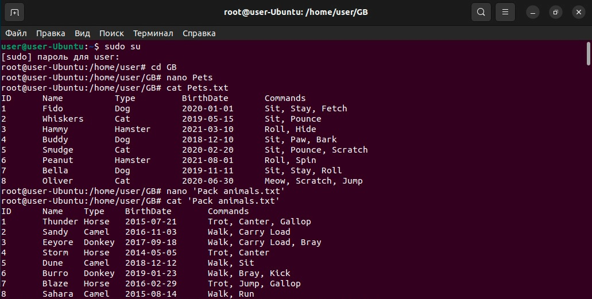

    1.1. Объединим содержимое этих двух файлов в один. Затем переименуем получившийся файл командой `mv` в "Human Friends" и просмотрим его содержимое командой `cat`.
    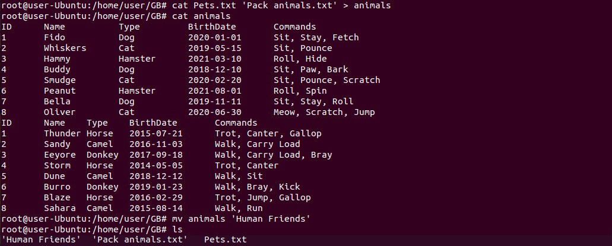

2. Создадим новую директорию folder и переместим туда файл "Human Friends".

3. Установим и настроим MySQL на Linux Ubuntu 22.04.1 используя следующую команду:
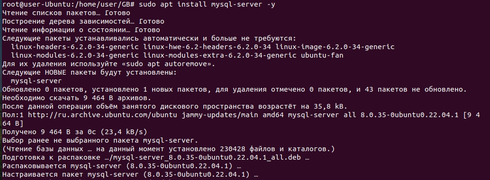
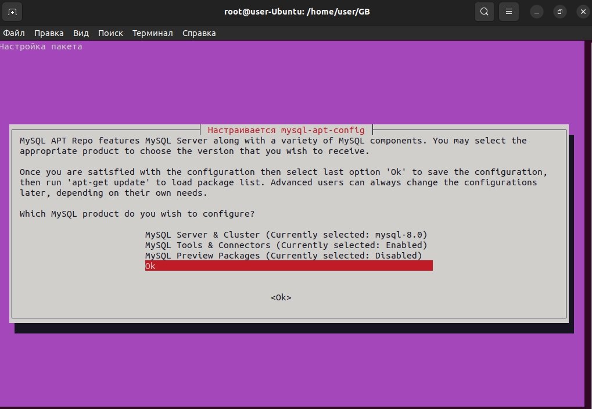

    3.1. Зайдём на сайт dev.mysql.com и найдем там название deb пакета MySQL APT Repository:
    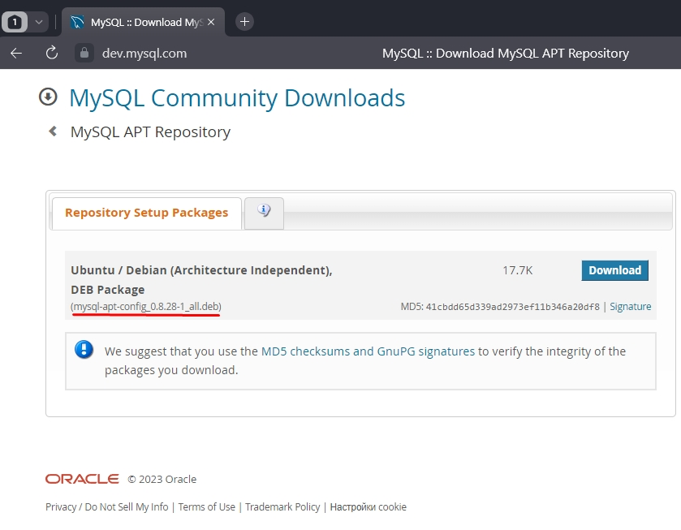

    3.2. Скопируем название файла пакета deb и с помощью команды `wget` скачаем данный пакет в нашу текущую директорию. Установим скаченный пакет deb и затем удалим его с помощью команды `dpkg`:

    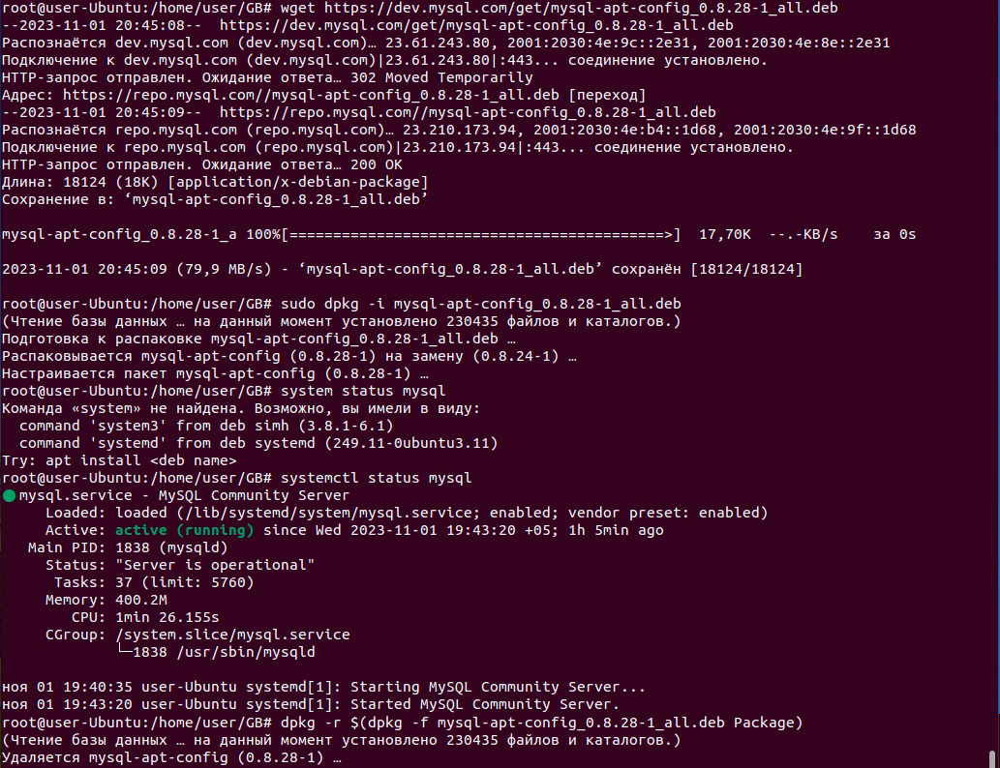

##  2. Объектно-ориентированное программирование
### Задание
1. Диаграмма классов.

    1.1. Создать диаграмму классов с родительским классом "Животные", и двумя подклассами: "Pets" и "Pack animals". В составы классов которых в случае Pets войдут классы: собаки, кошки, хомяки, а в класс Pack animals войдут: Лошади, верблюды и ослы. Каждый тип животных будет характеризоваться (например, имена, даты рождения, выполняемые команды и т.д). Диаграмму можно нарисовать в любом редакторе.

2. Работа с MySQL.

    2.1. После создания диаграммы классов в 1 пункте, во 2-м пункте база данных "Human Friends" должна быть структурирована в соответствии с этой диаграммой. Например, можно создать таблицы, которые будут соответствовать классам "Pets" и "Pack animals", и в этих таблицах будут поля, которые характеризуют каждый тип животных (например, имена, даты рождения, выполняемые команды и т.д.).

    2.2. В ранее подключенном MySQL создать базу данных с названием "Human Friends".
    - Создать таблицы, соответствующие иерархии из вашей диаграммы классов.
    - Заполнить таблицы данными о животных, их командах и датами рождения.
    - Удалить записи о верблюдах и объединить таблицы лошадей и ослов.
    - Создать новую таблицу для животных в возрасте от 1 до 3 лет и вычислить их возраст с точностью до месяца.
    - Объединить все созданные таблицы в одну, сохраняя информацию о принадлежности к исходным таблицам.

### Выполнение
1. Создадим диаграмму классов используя средство app.diagrams.net.    
    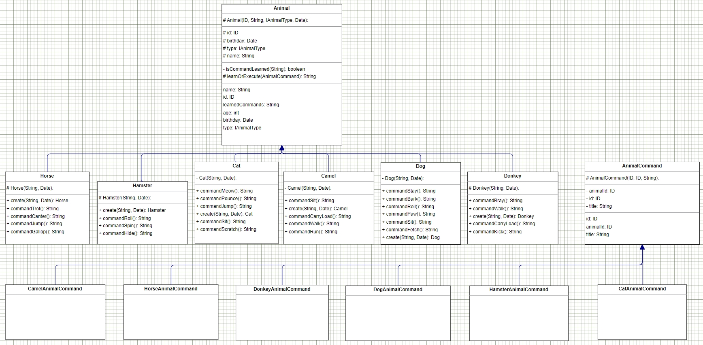

2. Используя MySQL Workbench создадим новую базу данных "Human Friends" и таблицы Category, Types, Animals, Commands. 

    
    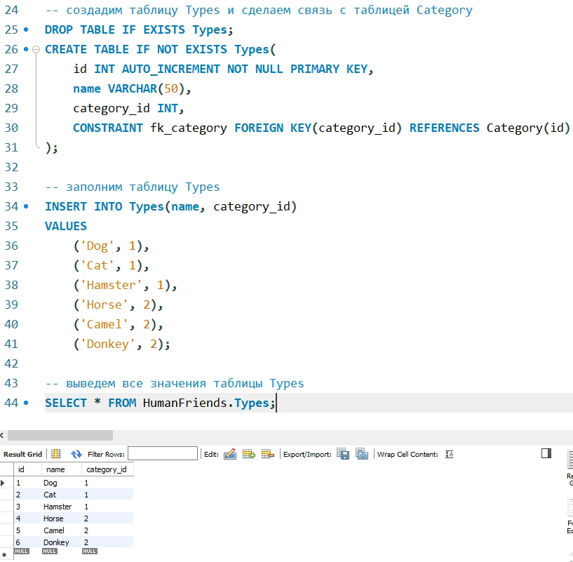
    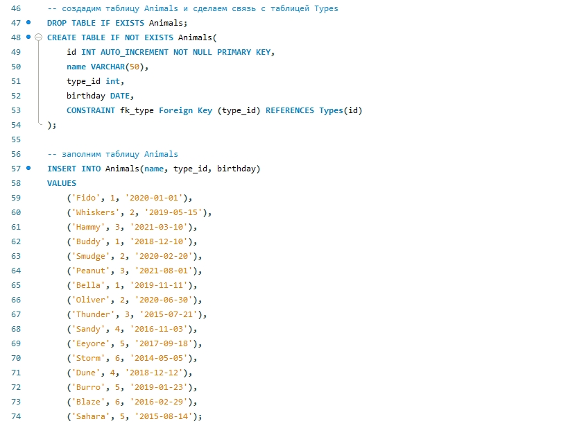
    
    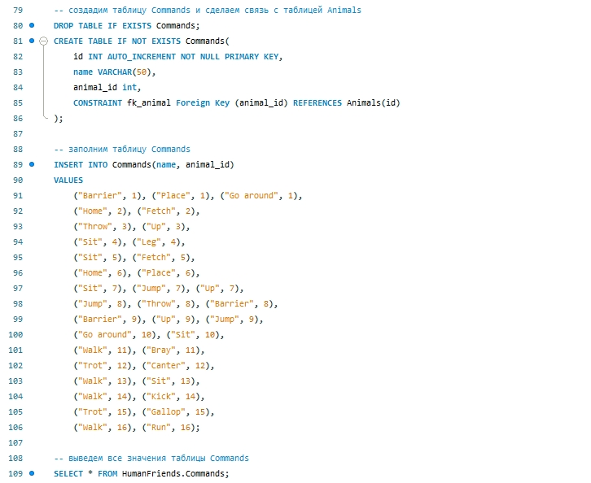
    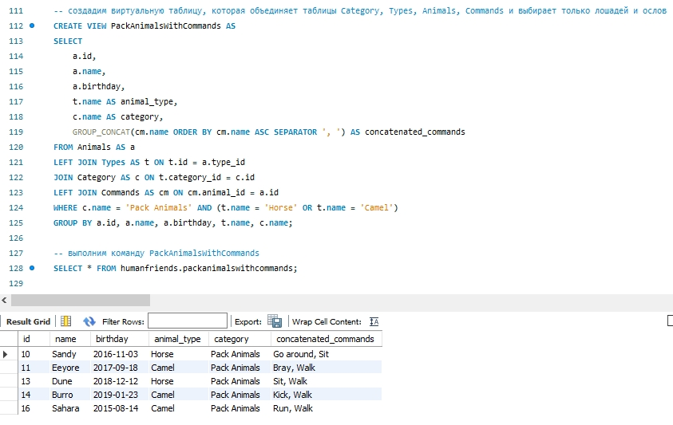
    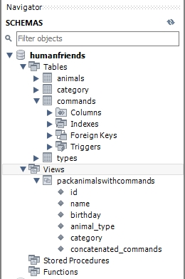
    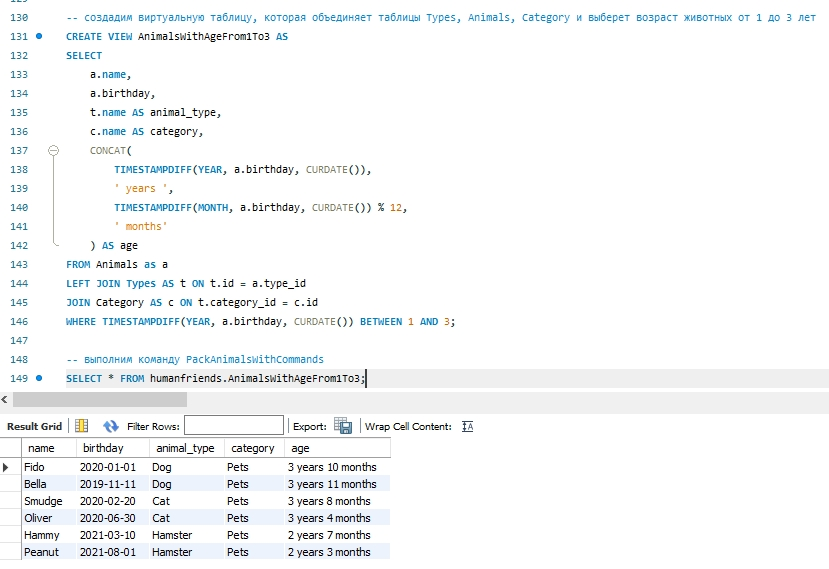
    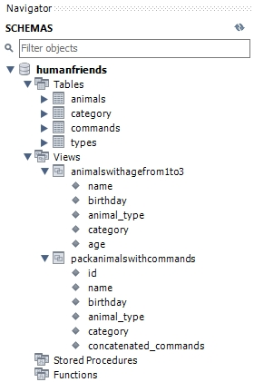
    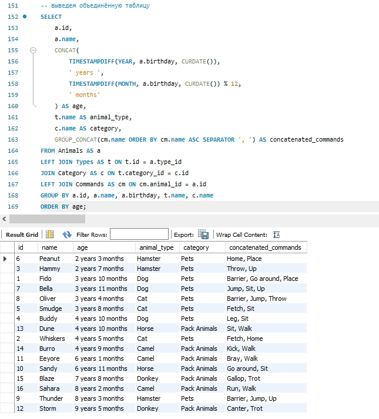
    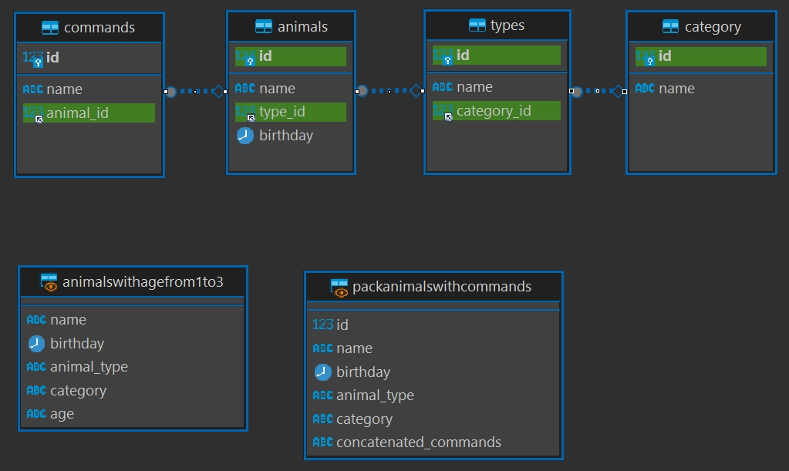

    [Ссылка на файл sql](./images/sql/sql.sql)

##  3. ООП и Java
### Задание
1. Создать иерархию классов в Java, который будет повторять диаграмму классов созданную в задаче 1.1(Диаграмма классов).

2. Программа-реестр домашних животных
    - Написать программу на Java, которая будет имитировать реестр домашних животных. 
    - Должен быть реализован следующий функционал:   
      - Добавление нового животного
          - Реализовать функциональность для добавления новых животных в реестр.       
          Животное должно определяться в правильный класс (например, "собака", "кошка", "хомяк" и т.д.)        
      - Список команд животного
          - Вывести список команд, которые может выполнять добавленное животное (например, "сидеть", "лежать").        
      - Обучение новым командам
          - Добавить возможность обучать животных новым командам.
      - Вывести список животных по дате рождения
      - Навигация по меню
          - Реализовать консольный пользовательский интерфейс с меню для навигации между вышеуказанными функциями.
        
3.  Счетчик животных
    - Создать механизм, который позволяет вывести на экран общее количество созданных животных любого типа (Как домашних, так и вьючных), то есть при создании каждого нового животного счетчик увеличивается на "1". 

### Выполнение

1. Иерархия классов в Java

    

2. Программа запускается с файла Main расположенного в [этой папке](./main_java/Main.java)

3. Создан механизм, который позволяет вывести на экран общее количество созданных животных любого типа (Как домашних, так и вьючных).
    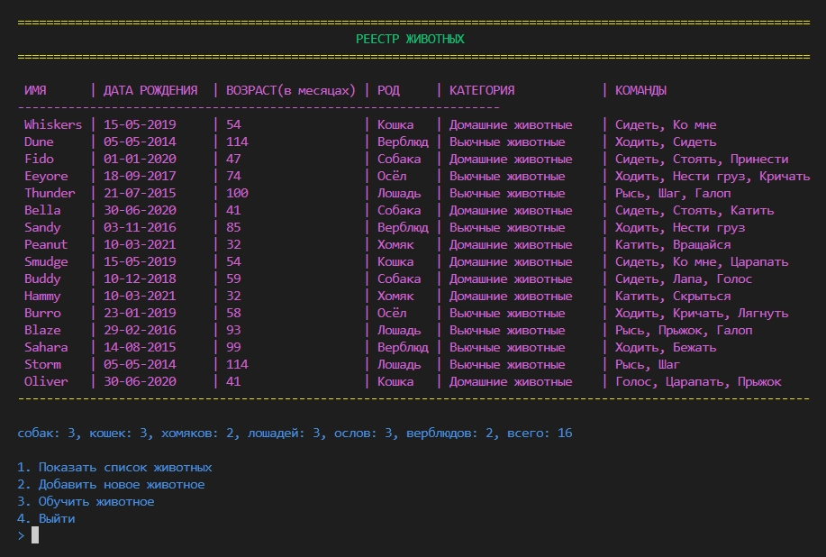
